# TP1-Aprendizaje-profundo-Red-Hopfield
Pequeña pero breve introducción: Este proyecto implementa una red neuronal de Hopfield, un tipo de red recurrente que se utiliza como memoria asociativa. Básicamente, la red puede ‘recordar’ patrones a partir de ejemplos, incluso cuando los recibe incompletos o con ruido.

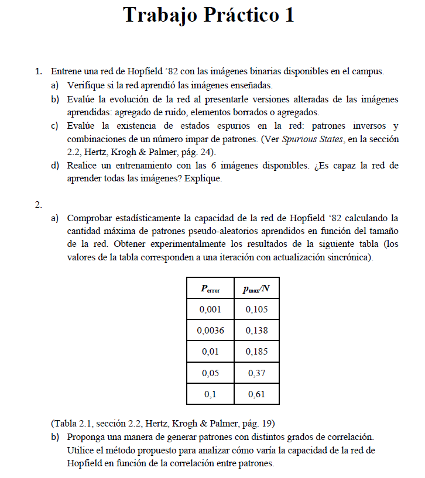

Resolución:
## 1 - a) Verificación del aprendizaje. La red recuerda lo que aprendió?
En esta sección, cargamos 3 imágenes simples (paloma, perro y panda):

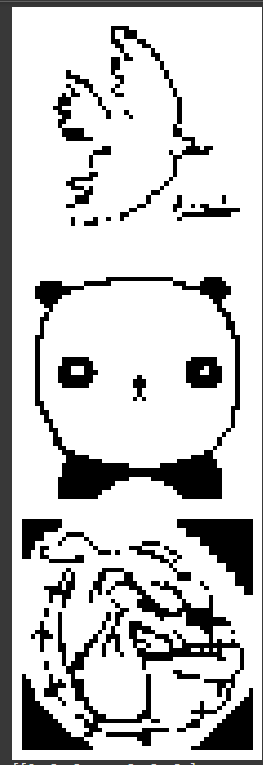

A cada imagen la transformamos en blanco y negro y la convertimos a un formato que la red puede procesar (una secuencia de valores -1 y 1, en lugar de pixeles comunes).

Luego, entrenamos la red de Hopfield con estas imágenes: Básicamente construimos una matriz de conexiones entre las neuronas que guarda la “memoria” de cada patrón.

La prueba fue la siguiente:

* Le volvimos a mostrar a la red exactamente las imágenes que había aprendido.
  
* Si la red había memorizado correctamente, al procesarlas no debía modificarlas.
  
* En otras palabras, debía devolver la misma imagen que se le dio como entrada.
  
Resultado: Todas las imágenes fueron recordadas correctamente: la red devolvió la misma que se le había enseñado.
Esto significa que la red realmente aprendió esos patrones y puede almacenarlos en su “memoria asociativa”.

## 1 - b) Evaluación de la red con imágenes alteradas

En este apartado probamos qué tan robusta es la red de Hopfield cuando le damos imágenes modificadas en lugar de las originales. La idea es ver si la red puede "recordar" y reconstruir correctamente la versión aprendida, incluso cuando la entrada tiene errores o está incompleta.
Realicé tres tipos de pruebas:
### 1. Imágenes parcialmente tapadas:
  * Tapamos la mitad de abajo de las 3 respectivas imágenes.

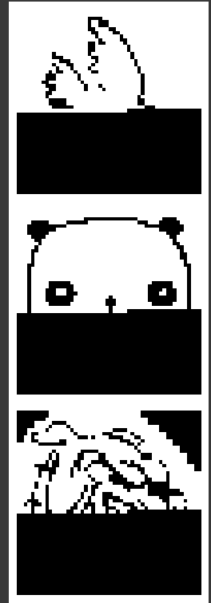
  * Al reconstruirlas, la red fue capaz de recuperar bastante bien la forma original, demostrando que “rellena” la información faltante a partir de lo que aprendió. Excepto por la última imagen:

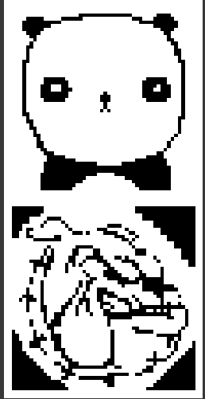
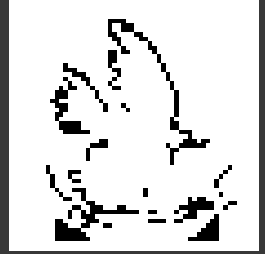

La conclusión de este punto es que incluso con un 50% de los píxeles tapados, mas de la mitad de las imágenes seguían siendo reconocibles.

### 2. Imágenes con ruido:
  * Introdujimos ruido aleatorio, invirtiendo valores de algunos píxeles.
  * Con niveles bajos de ruido (10% o 30%), la red reconstruyó casi perfectamente las imágenes.
  * Con ruido muy alto (50% o 90%), los resultados fueron mucho peores, porque la entrada ya no se parece a lo aprendido.
    
  Imágenes con 10% de ruido:
  
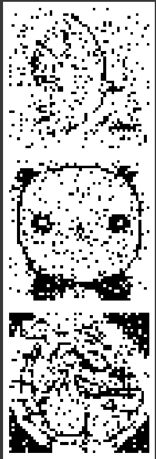

  Este es el resultado de la reconstrucción que le aplicó la red a las imagenes que tenían 10% de ruido:

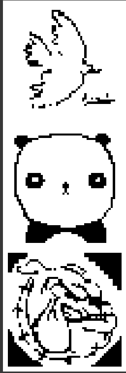

  Imágenes con 50% de ruido:

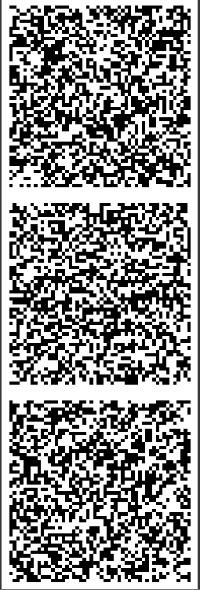

  Este es el resultado de la reconstrucción que le aplicó la red a las imágenes que tenían 50% de ruido:

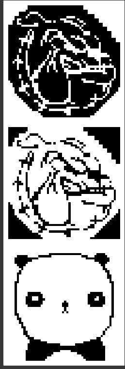

  Imágenes con 90% de ruido:

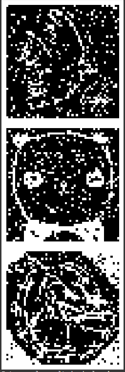

  Este es el resultado de la reconstrucción que le aplicó la red a las imágenes que teniían 90% de ruido:

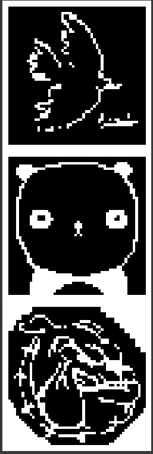

  Esto muestra el límite de memoria de la red: puede corregir errores hasta cierto punto, pero no recuperar una imagen que está casi destruida.

  ### 3. Imágenes con eliminación de píxeles:
  
  * Para este caso, hemos probado con borrar los pixeles del set imagenes. Primero con el 50% de pixeles borrados y luego con el 90% de pixeles borrados.

    Pixeles borrados al 50%

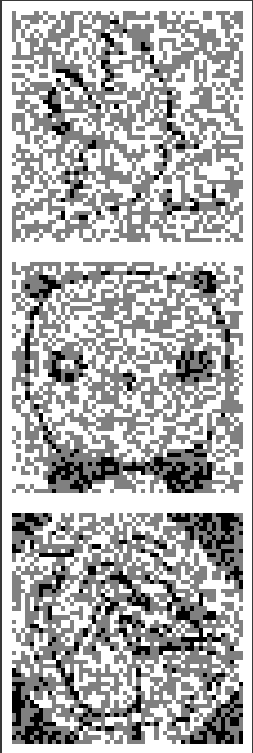

  Pixeles borrados al 90%

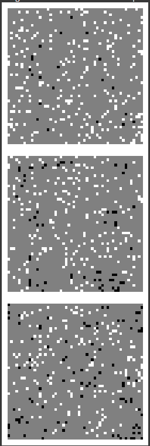

  * La conclusión para ambos casos, es que la red fue capaz de recuperar todas las imagenes, lo que demuestra su alta capacidad de memoria para estos casos.

    Set de imágenes recuperadas para ambos casos

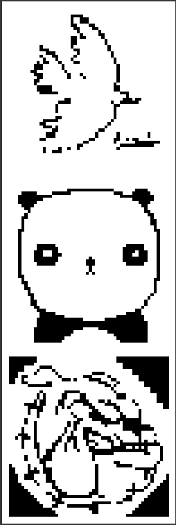

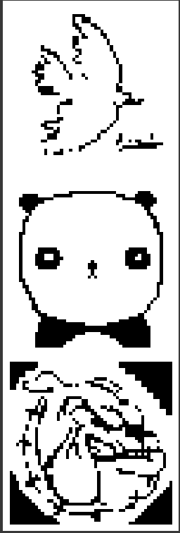

## 1 - c) Estados Espurios en la Red de Hopfield
Una red de Hopfield no solo puede recuperar los patrones que le enseñamos, sino también otros estados no deseados llamados estados espurios. 
Estos aparecen porque, al superponerse los recuerdos, la red genera "mínimos de energía falsos" que no corresponden a imágenes originales.

* Patrones inversos: si la red aprendió una imagen con fondo blanco y figura negra, el inverso es la misma figura pero con colores invertidos. El experimento mostró que estos inversos fueron reconocidos como estados estables, por lo tanto, son estados espurios.
* Combinaciones de un número impar de patrones: al mezclar varias imágenes y dárselas a la red, esta también las estabilizó en un estado que no era ninguna de las imágenes originales, confirmando otro caso de estado espurio.

Primer tipo de estado espurio (Patrones inversos):

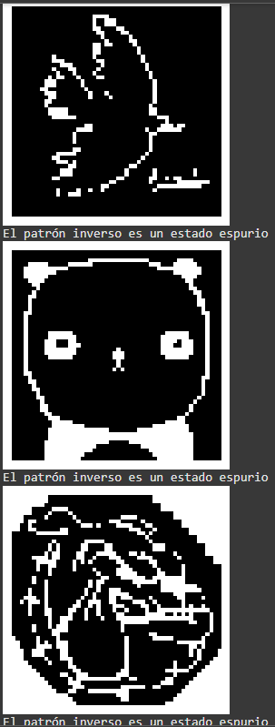

Segundo tipo de estado espurio (Combinación de número impar de patrones):

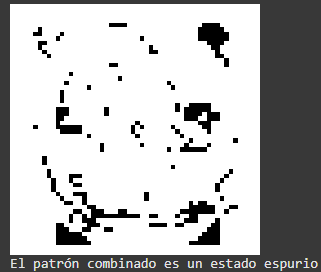

## 1 - d) Entrenamiento con las 6 imágenes
En este punto entrenamos la red de Hopfield con las 6 imágenes disponibles (paloma, panda, perro, quijote, torero y V de Vendetta).
Resultados: 
* La red logró recordar correctamente 4 imágenes.
* Las imágenes de la paloma y el panda no fueron aprendidas de forma correcta, mostrando versiones incompletas o distorsionadas.
  
Las imágenes que utilizadas para el entrenamiento:

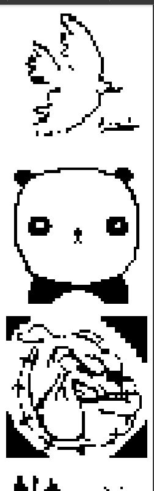

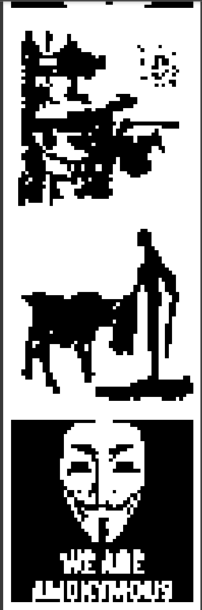

Las imágenes que no fueron aprendidas:

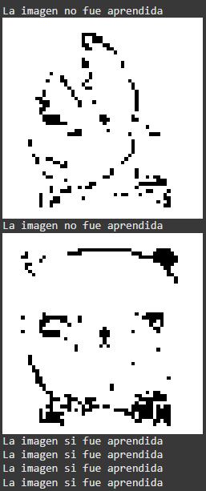

Explicación sencilla de lo que pasa:
La red de Hopfield tiene una capacidad limitada de memoria.
En teoría, la cantidad máxima de patrones que puede almacenar sin errores está dada por:
  pmax​≈0.138×N
donde N es la cantidad de neuronas (en este caso, los píxeles de cada imagen).
Para nuestras imágenes (52×52 = 2704 píxeles), la capacidad máxima teórica es:

𝑝
𝑚
𝑎
𝑥
≈
0.138
×
2704
≈
373
 patrones.

Esto es muchísimo más que 6, por lo que parecería que no debería haber problema.
Sin embargo, en la práctica la red no funciona bien cuando los patrones son similares entre sí (no ortogonales). 
En nuestro caso, la paloma y el panda comparten ciertas características, lo que genera interferencia al almacenarse junto con las demás imágenes.

Conclusión: Aunque teóricamente la red puede almacenar cientos de patrones, en la práctica su desempeño real es mucho menor debido a la superposición y similitud entre imágenes. 
Por eso, solo 4 de las 6 fueron recordadas con éxito.
